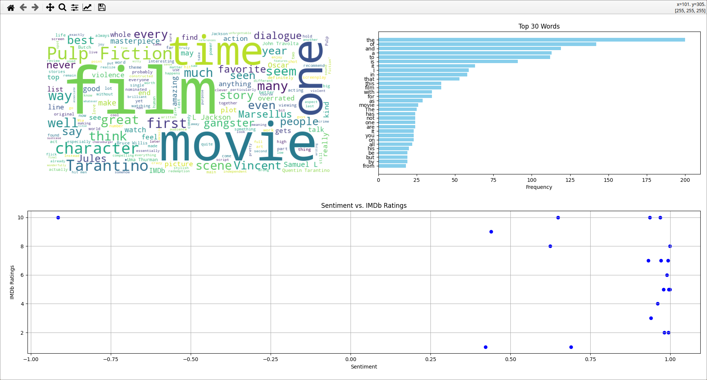

Natural Language Processing - sentiment analyzer  
Requirement can be installed with:  
```python
pip install -r requirements.txt
```   
Can be run with:  
```python
python main.py
```  
The output is 3 windows that open in sequence after closing the previous one, it takes a moment  
